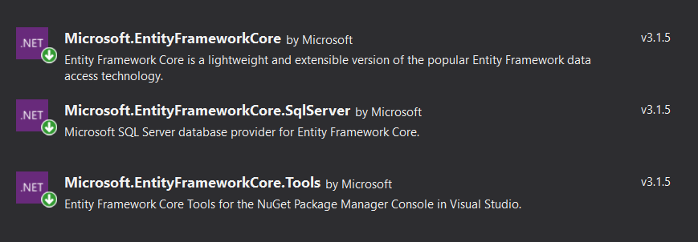

# Getting Started

This article shows how to create a sample .NET Core 3.1 application using __RadEntityFrameworkCoreDataSource__ and __RadGridView__.

> __RadEntityFrameworkCoreDataSource__ is built on top of [Entity Framework Core](https://docs.microsoft.com/en-us/ef/core/). You should familiarize yourself with the framework before going over this tutorial.

## Creating the WPF (.NET Core) Application

Start Visual Studio 2019 (or newer), select "Create a new project" and choose WPF App (.NET Core).

#### __Figure 1: WPF (.NET Core) Application__

## Adding References

Before we get started, we will add the following NuGet packages.

* __Microsoft.EntityFrameworkCore__
* __Microsoft.EntityFrameworkCore.SqlServer__
* __Microsoft.EntityFrameworkCore.Tools__

	#### __Figure 2: NuGet Packages__
	

We will also add the needed Telerik references.

* __Telerik.Windows.Controls__
* __Telerik.Windows.Controls.Data__
* __Telerik.Windows.Controls.EntityFrameworkCore__
* __Telerik.Windows.Controls.GridView__
* __Telerik.Windows.Controls.Input__
* __Telerik.Windows.Data__

## Xaml Usage

__Example 1__ demonstrates how you can set up the RadEntityFrameworkCoreDataSource and display data in a RadGridView. It assumes that you already have a DbContext named "MyEntityModel", which contains a DbSet called "Customers". 

> In case you don't have a DbContext/database setup, you can check out the [MVVM Usage]() article, which shows how you can set them up from scratch.

#### __[XAML] Example 1: Defining RadEntityFrameworkCoreDataSource in xaml__
{{region xaml-entityframeworkcore-getting-started-0}}

    <telerik:RadEntityFrameworkCoreDataSource Name="EntityFrameworkCoreDataSource" QueryName="Customers"> 
        <telerik:RadEntityFrameworkCoreDataSource.DbContext> 
            <local:MyEntityModel/> 
        </telerik:RadEntityFrameworkCoreDataSource.DbContext> 
    </telerik:RadEntityFrameworkCoreDataSource> 
    <telerik:RadGridView ItemsSource="{Binding DataView, ElementName=EntityFrameworkCoreDataSource}"/>
{{endregion}}

## See also

* [RadGridView]()